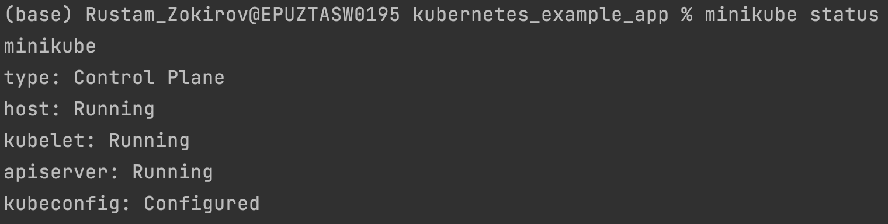
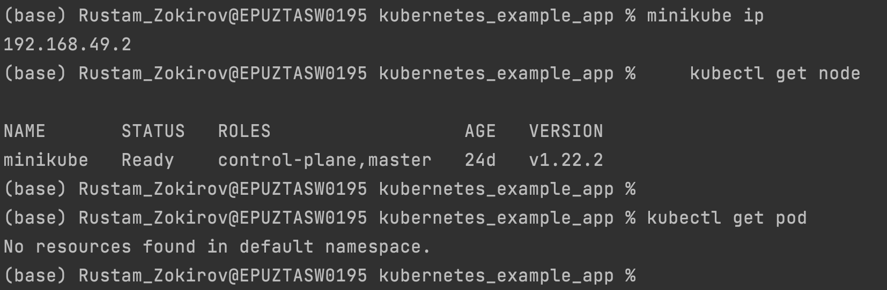
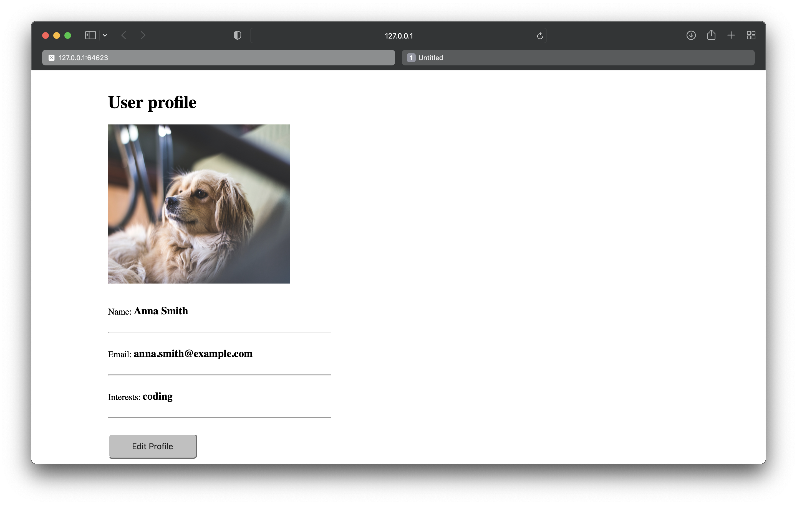

# Kubernetes example app with MongoDB and Web App

## K8s manifest files 
* mongo-config.yaml
* mongo-secret.yaml
* mongo.yaml
* webapp.yaml

## K8s commands

### start Minikube and check status
    minikube start --vm-driver=hyperkit 
    minikube status


### get minikube node's ip address
    minikube ip

### get basic info about k8s components
    kubectl get node
    kubectl get pod
    kubectl get svc
    kubectl get all



<br> If you have output with "No resources found in default namespace." Then you need to execute the following, and try above commands again:

```cmd
$ kubectl apply -f mongo-config.yaml
$ kubectl apply -f mongo-secret.yaml
$ kubectl apply -f mongo.yaml
$ kubectl apply -f webapp.yaml
```

### get extended info about components
    kubectl get pod -o wide
    kubectl get node -o wide

### get detailed info about a specific component
    kubectl describe svc {svc-name}
    kubectl describe pod {pod-name}

### get application logs
    kubectl logs {pod-name}
    
### stop your Minikube cluster
    minikube stop

<br />

> :warning: **Known issue - Minikube IP not accessible** 

If you can't access the NodePort service webapp with `MinikubeIP:NodePort`, execute the following command:
    
    minikube service webapp-service
    docker port minikube 
    kubectl get svc 
    curl http://127.0.0.1:30100



<br />

## Links
* mongodb image on Docker Hub: https://hub.docker.com/_/mongo
* webapp image on Docker Hub: https://hub.docker.com/repository/docker/nanajanashia/k8s-demo-app
* k8s official documentation: https://kubernetes.io/docs/home/
* webapp code repo: https://gitlab.com/nanuchi/developing-with-docker/-/tree/feature/k8s-in-hour
* https://github.com/kubernetes/minikube/issues/11193

